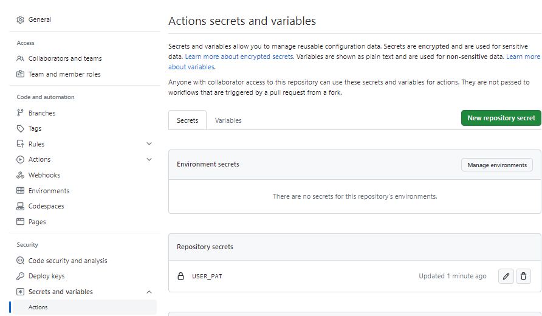

# github-provisioner
Kaiser Permanente Provisioner Solution

### Pre-requisites:
1. Add USER_PAT into Actions secrets.

2. Make sure to enable "Allow GitHub Actions to create and approve pull requests" under "settings > Actions > General > Workflow permissions" for the repository.

### Troubleshooting:
1. If "Allow GitHub Actions to create and approve pull requests" is grayed out, check the organization-level settings, i.e. https://github.com/organizations/im-customers/settings/actions
2. If the workflow "Issue inputs, create branch and push changes" gets stuck at "Authenticate with GitHub" step then check on authorizing the PAT to access the Organization and repository, otherwise it will be waiting for authorizing process and gets stuck at Authenticating to GitHub.
3. Make sure to enable "Allow GitHub Actions to create and approve pull requests" under "settings > Actions > General > Workflow permissions" for the repository.
